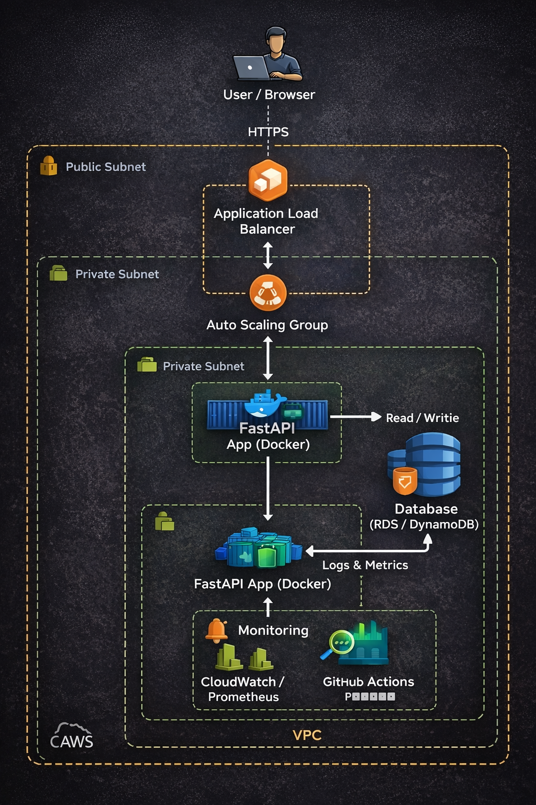

# Secure Cloud-Native Application


A production-ready cloud-native application on AWS demonstrating CI/CD, Infrastructure as Code, Containerization, Monitoring, and Security best practices.

---

## Architecture



```
User
  |
  v
Application Load Balancer
  |
  v
Auto Scaling Group
  |
  v
FastAPI Application (Docker)
  |
  +--> Database (RDS / DynamoDB)
  |
  +--> Monitoring (CloudWatch / Prometheus)
```

---

## Tech Stack

### Cloud
- AWS EC2
- Application Load Balancer
- Auto Scaling Group
- CloudWatch

### Application
- Python
- FastAPI

### Containerization
- Docker

### Infrastructure as Code
- Terraform

### CI/CD
- GitHub Actions

### Monitoring
- Prometheus
- CloudWatch

---

## Repository Structure

```
cloud-devops-project/
├── app/                # FastAPI source code
├── docker/             # Dockerfile
├── terraform/          # Infrastructure as Code
├── monitoring/         # Prometheus configs
├── .github/workflows/  # CI/CD pipelines
├── local_test.sh
└── README.md
```

---

## Security Highlights

- Least privilege IAM roles
- Application runs in private subnets
- No hardcoded secrets
- Non-root Docker containers
- Secure CI/CD pipeline

---

## 💰 Cost Awareness

This project is designed with cost efficiency in mind and aligns with AWS Free Tier wherever possible.

- Uses **Application Load Balancer + Auto Scaling Group** only for demonstration purposes
- Infrastructure is intended to be **created and destroyed on demand**
- Supports running with **t2.micro / t3.micro** instances
- No long-running resources are required
- Monitoring configured to avoid high-cost metrics ingestion
- Designed for learning and portfolio demonstration, not 24/7 production usage

> ⚠️ **Note:** Users should always delete AWS resources after testing to avoid unexpected charges.

## Run Locally

```bash
git clone https://github.com/nilansh-sinha/cloud-devops-project.git
cd cloud-devops-project

docker build -t cloud-devops-app ./docker
docker run -p 8000:8000 cloud-devops-app
```

Access the application:
```
http://localhost:8000
```

---

## Author

**Nilansh Sinha**  
B.Tech – Cyber Security  
VIT Vellore  

GitHub: https://github.com/nilansh-sinha
